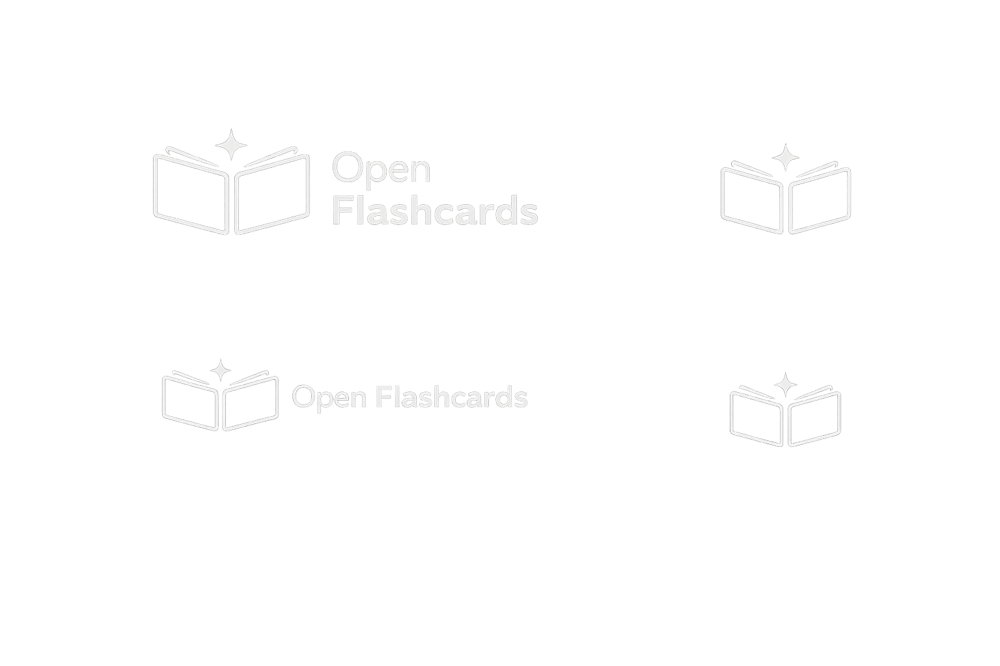
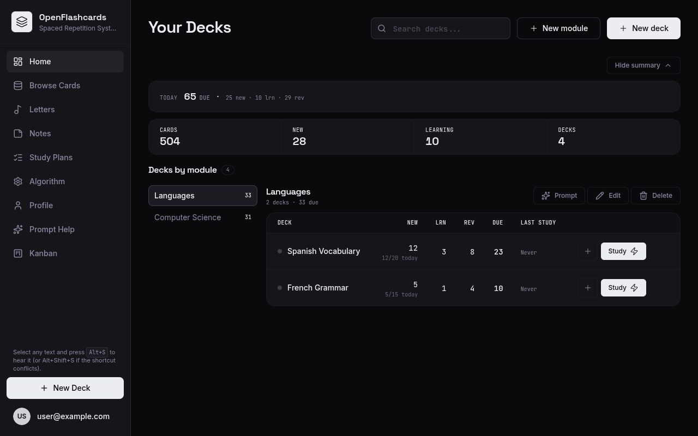
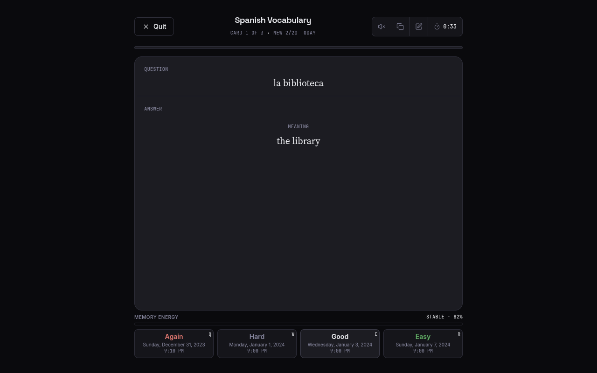

<p align="center">
  
</p>

<h1 align="center">OpenFlashcards</h1>

<p align="center">
  Self-hosted flashcards with FSRS spaced repetition and built-in text-to-speech.<br/>
  Built for language learners. One command to run.
</p>

<p align="center">
  <a href="https://github.com/HelioFernandes404/openflashcards/actions/workflows/ci.yml"></a>
  <a href="LICENSE"></a>
  <a href="https://github.com/HelioFernandes404/openflashcards/releases"></a>
</p>

---

<p align="center">
  
  
</p>

## Why OpenFlashcards?

- 🧠 **FSRS scheduler** — the modern spaced-repetition algorithm (same family Anki adopted), not SM-2
- 🎙️ **Native text-to-speech** — hear every card. Google Cloud, ElevenLabs, or fully local with Piper
- 🗣️ **Made for language learning** — phonetic hints, pronunciation cards, learn-through-lyrics mode
- 📝 **Markdown cards** — code blocks, lists, formatting
- 🏠 **Self-hosted & private** — your data in your PostgreSQL, MIT licensed
- ⚡ **Modern stack** — Go API, React 19 + Vite frontend, Docker Compose deploy

## Quick Start

```bash
git clone https://github.com/HelioFernandes404/openflashcards.git
cd openflashcards
cp .env.example .env   # set POSTGRES_PASSWORD
docker compose up -d
```

Open http://localhost:5173 — API docs at http://localhost:3030/api/v1/docs.

> Generate a secret: `openssl rand -hex 32`

## Text-to-Speech

| Provider | Cost | Quality | Offline |
|---|---|---|---|
| **Piper** | Free | Good | ✅ Yes |
| **Google Cloud TTS** | Free tier | Great | ❌ |
| **ElevenLabs** | Paid | Best | ❌ |

Set `TTS_PROVIDER` in `.env`. Full options in [.env.example](.env.example).

## Development

```bash
make dev    # runs API (Go) + web (Vite) locally
make test   # all tests
```

Frontend-only (no backend needed):

```bash
cd apps/web && npm install && VITE_MSW=true npm run dev
```

See [CONTRIBUTING.md](CONTRIBUTING.md) for guidelines.

## Architecture

```
apps/api   Go + Gin, PostgreSQL, Redis (TTS queue), sqlc migrations
apps/web   React 19, Vite, TanStack Query, Biome
```

## Environment Variables

All configuration lives in `.env` — see [.env.example](.env.example) for the full annotated list (database, CORS, Redis, TTS providers).

## Deployment

Docker Compose behind any reverse proxy with TLS. For production: set `ENVIRONMENT=production`, `LOG_LEVEL=info`, and `CORS_ALLOWED_ORIGINS` to your domain.

### Run from prebuilt images

Skip building locally — pull the images published to GHCR on every tagged release:

```bash
cp .env.example .env   # set POSTGRES_PASSWORD
docker compose -f docker-compose.ghcr.yaml up -d
```

Pin a specific version instead of `latest`:

```bash
IMAGE_TAG=0.1.0 docker compose -f docker-compose.ghcr.yaml up -d
```

Images: [`ghcr.io/heliofernandes404/openflashcards-api`](https://github.com/HelioFernandes404/openflashcards/pkgs/container/openflashcards-api) and [`ghcr.io/heliofernandes404/openflashcards-web`](https://github.com/HelioFernandes404/openflashcards/pkgs/container/openflashcards-web).

## Contributing

Contributions welcome! Read [CONTRIBUTING.md](CONTRIBUTING.md) to get started. Bug reports and feature requests via [issues](https://github.com/HelioFernandes404/openflashcards/issues); questions in [discussions](https://github.com/HelioFernandes404/openflashcards/discussions).

## License

[MIT](LICENSE) © 2026 Helio Fernandes and contributors
